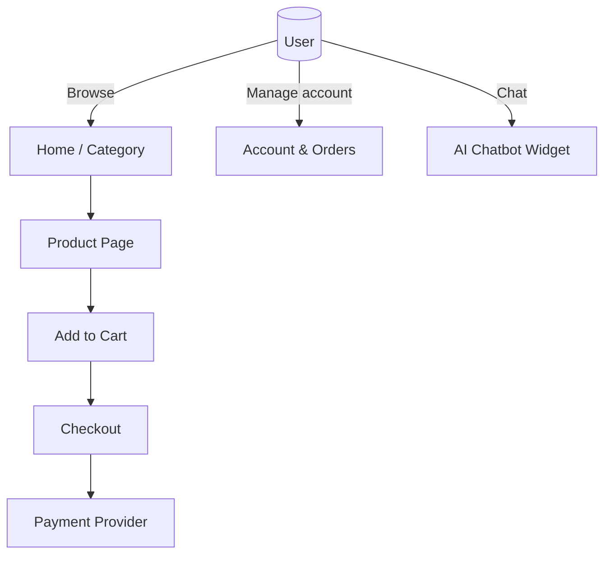
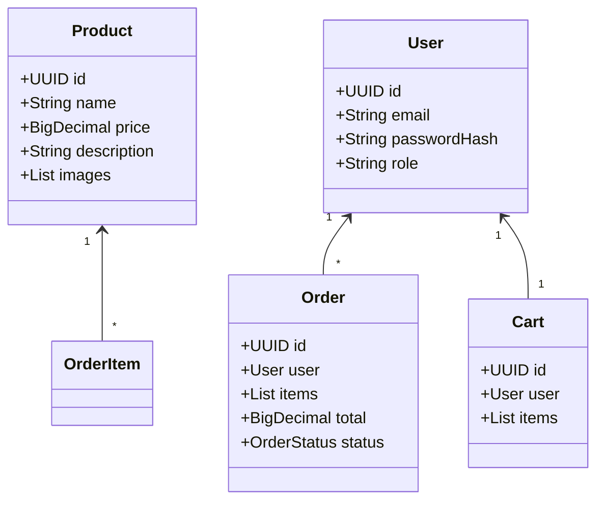
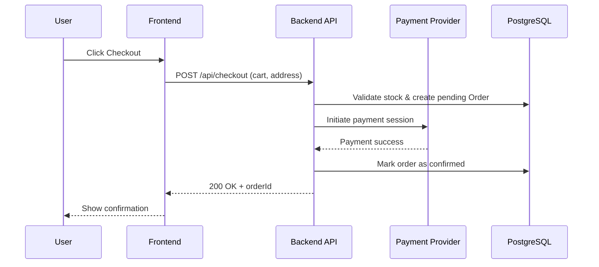

**Project Overview**

- **Purpose**: Build an e-commerce website selling clothes, toys, and tech gadgets with a modern JS frontend (Next.js + React + TypeScript + Tailwind), Java backend, PostgreSQL, Dockerized deployment, CI/CD, and an integrated AI chatbot.
- **Non-Goals**: Payment gateway provider implementation details (we'll integrate via provider SDKs), custom LLM training (use hosted LLM + RAG), and physical shipping integrations (provide hooks/APIs).

**High-Level Goals**

- **Scalable Architecture**: Separate frontend, backend, and AI chatbot service; container-first deployment.
- **Security-first**: Strong authentication, hashing, HTTPS, secrets management, secure defaults.
- **SOLID design**: Backend code follows SOLID principles and layered architecture (controllers → services → repositories).
- **CI/CD**: Automated pipelines for build, test, and deploy to staging and production.

**Tech Stack**

- **Frontend**: Next.js (app router), React, TypeScript, Tailwind CSS
- **Backend**: Java (Spring Boot or Quarkus), typed DTOs, REST/HTTP + GraphQL optional
- **DB**: PostgreSQL (primary), migrations via Flyway or Liquibase
- **Auth**: JWT + refresh tokens, optional OAuth2 social login
- **AI Chatbot**: Separate microservice (Node.js or Java) that handles RAG + calls to an LLM provider (OpenAI/Azure/etc.)
- **Containerization**: Docker + docker-compose for local dev; Kubernetes for production (optional)
- **CI/CD**: GitHub Actions / GitLab CI (build/test/lint/docker push/deploy)

**Design Stage**

- **Research & Personas**: Define buyer personas (casual shopper, tech enthusiast, parent buying toys).
- **UX Flows**: Browsing → Product page → Add to cart → Checkout → Order confirmation.
- **Wireframes**: Desktop / mobile key screens: Home, Category, Product, Cart, Checkout, Account, Chatbot.
- **Accessibility**: Follow WCAG basics (semantic HTML, keyboard nav, color contrast).

**Diagrams (high-level)**

**Use Case (Flowchart)**

**Class Diagram (Backend - high level)**

**Flow Diagram (Checkout sequence)**

**Database & Schema (overview)**

- **Tables**: users, products, categories, product_images, carts, cart_items, orders, order_items, payments, sessions, embeddings (for AI RAG)
- **Indices**: product name, category, user email (unique), orders by user + date
- **Migrations**: Use Flyway/LIquibase with versioned scripts

**API Surface (core endpoints)**

- Public: `GET /api/products`, `GET /api/products/:id`, `GET /api/categories`
- Auth: `POST /api/auth/signup`, `POST /api/auth/login`, `POST /api/auth/refresh`, `POST /api/auth/logout`
- Cart: `GET/POST /api/cart`, `POST /api/cart/items`
- Checkout: `POST /api/checkout`
 - Checkout: `POST /api/checkout` (requires authenticated user — login/register)
- Orders: `GET /api/orders`, `GET /api/orders/:id`
- Admin: `POST /api/products`, `PUT /api/products/:id`, `DELETE /api/products/:id` (RBAC enforced)
- Chat: `POST /api/chat/query` (proxied to AI service)

**Authentication & Security (critical notes)**

- **Password storage**: Use Argon2id or bcrypt with a secure cost and unique per-user salt.
- **Tokens**: Issue short-lived JWTs (access token) and store refresh tokens in DB with rotation and revocation support.
- **Transport**: Enforce HTTPS; HSTS headers for production.
- **CORS**: Restrictive CORS policy allowing only trusted origins.
- **CSRF**: For browser-based non-SPA stateful endpoints, implement CSRF tokens; with JWT stateless SPA, ensure same-site cookies for refresh tokens.
- **Rate limiting & brute-force protection**: IP/user-based throttling on auth endpoints.
- **Input validation & sanitization**: Use DTO validation (Bean Validation in Java) and parameterized queries to avoid SQL injection.
- **Secrets management**: Store secrets in environment variables or secret store (Vault/Azure Key Vault); do not commit to repo.
- **RBAC**: Roles `USER`, `ADMIN` enforced at controller/service layer.
- **Logging & monitoring**: Audit auth events, monitor suspicious activity, centralize logs (ELK or similar).
- **Penetration testing**: Include OWASP Top10 checks in testing pipeline.

**Order creation & email notifications**

- **Require authentication**: Users must be logged in (or register) to create an order — enforce at API gateway/controller layer and validate user identity in service layer.
- **Order confirmation email**: After payment success and order confirmed, send a transactional email to the user's verified email address with order summary, expected delivery, and support contacts. Use a transactional email provider (SendGrid, SES, Mailgun) and queue emails (e.g., via Redis + background worker) to avoid blocking the request.
- **Email retries & failure handling**: Persist email jobs, retry with exponential backoff, and surface permanent failures to monitoring/alerts.

**AI Chatbot Integration**

- **Approach**: Use Retrieval-Augmented Generation (RAG). Store product docs, FAQs, and policy text in an embeddings index for retrieval.
- **Components**:
	- Chat UI (frontend widget) — minimalist floating widget, sends queries to backend endpoint.
	- Chat Service — accepts query, retrieves relevant docs, builds prompt, calls LLM provider, returns answer.
	- Embeddings store — Postgres (table) or vector DB (Pinecone, Milvus) to serve nearest-neighbor retrieval.
	- Moderation & safety: filter outputs, rate-limit, and track user queries.
- **Data privacy**: Do not send PII to third-party LLMs unless consented and compliant.

**SOLID & Code Quality Guidelines**

- **Single Responsibility**: Controllers only handle HTTP; business logic in services; persistence in repositories.
- **Open/Closed**: Use interfaces and DI so behavior can be extended without modification.
- **Liskov Substitution**: Use interface contracts and avoid narrowing preconditions in subclasses.
- **Interface Segregation**: Prefer smaller, focused interfaces.
- **Dependency Inversion**: Depend on abstractions (interfaces) and inject concrete implementations.
- **Testing**: Unit tests for services + integration tests for repositories and controllers.
- **Linters & formatters**: ESLint/Prettier for frontend; Checkstyle/SpotBugs/Spotless/Google Java Format for backend.

**CI/CD (recommended pipeline)**

- **PR checks**: Run linters, typecheck (TS), unit tests, and build for frontend and backend.
- **Build**: Build frontend static assets; build backend JAR/container.
- **Container**: Build Docker images and push to registry on main branch.
- **Deploy**: Deploy to staging automatically; manual approval for production.
- **Security gates**: Run dependency scanning (Snyk/Dependabot), static analysis, and basic secret scanning.

**Deployment & Infrastructure**

- **Local dev**: docker-compose with services: frontend, backend, postgres, redis (session/cache), chat-service.
- **Staging/Prod**: Kubernetes cluster or managed container service (Azure App Service / AWS ECS / GCP Cloud Run).
- **DB**: Managed Postgres in prod; backups and read replicas as needed.
- **Secrets**: Managed secret store (Vault/Azure Key Vault).

**Testing Strategy**

- **Unit tests**: Services and utilities.
- **Integration tests**: Backend with an ephemeral Postgres (Testcontainers) and mock payment provider.
- **E2E tests**: Playwright or Cypress covering main user flows (browse, add to cart, checkout, account, chat).
- **Load tests**: Simulate peak shopping traffic for checkout and search.

**Milestones & Timeline (indicative)**

- Week 1: Requirements, UX wireframes, DB model, and key diagrams
- Week 2: Frontend scaffold + backend scaffold, auth service
- Week 3: Product CRUD, cart, checkout flow, DB migrations
- Week 4: AI chatbot service integration + embeddings ingestion
- Week 5: Tests, Dockerization, CI/CD pipeline
- Week 6: Staging deployment, QA, hardening, launch prep

**Deliverables**

- Working Next.js frontend wired to Java backend
- Docker compose for local dev
- CI pipeline (build/test/image push, deploy to staging)
- Security checklist and auth implementation
- AI chatbot service with retrieval pipeline
- Documentation and runbook

**Next steps**

- Finalize product data model and create initial Flyway migrations.
- Create frontend and backend repos (monorepo optional) and scaffold.
- Implement auth primitives and write tests for login/refresh flows.

